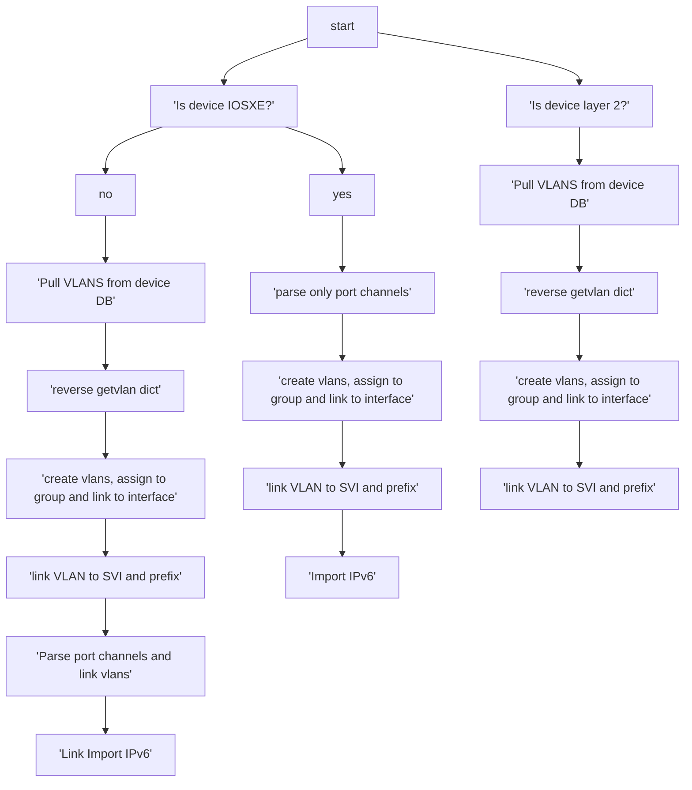
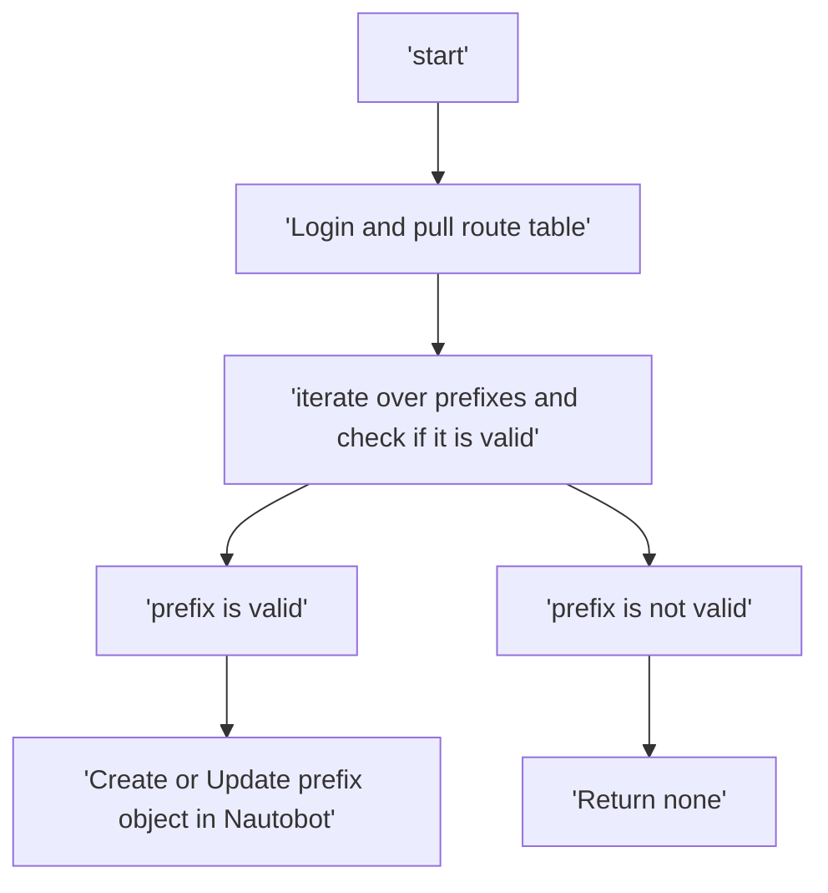

# Nautobot Cleaner

### what it does?

Cleaner isnt the best word, but it helps to import data that network importer does not do well in a multi-tenant enviroment.

### How it works?

Uses a mix of Napalm and Netmiko to parse vlan & static route information and create it in Nautobot

## Importing VLANs

```python
from importdevicevlans import NautobotCleanerVlans

nbv = NautobotCleanerVlans()
nbv.importdevicevlans(selected_devices=[
    'device1-fqdn',
    'device2-fqdn',
],
    group='vlan-group')
```


## Importing Static routes

We are using the devices static route table to import prefixes direclty into Nautobot.

To use, import and instatiate, then call the method as such

```Python
from importdeviceroutes import NautobotCleanerRoutes

nbr = NautobotCleanerRoutes()
nbr.importdevicestaticroutes(selected_devices=[
        'router1.acme.com',
        'router2.acme.com',
    ])
```



## Importing from LibreNMS

This function just pulls the device information based on groups from Librenms to populate Nautobot

Instatiate the class and run the method. Currently it expect a group name from Librensm. It must match!

```python
from netmonimporter import NautobotCleanerNetmonImport

nbn = NautobotCleanerNetmonImport()

nbn.add_device_to_nautobot(deviceGroup=[
        'ACME_ROUTERS'
    ])
```

part of the inventory build is to match the mgmt interface that the resolved IP of the FQDN uses to its interface. 
This is needed as it is important to stage this for the Network Imported from Network To Code

